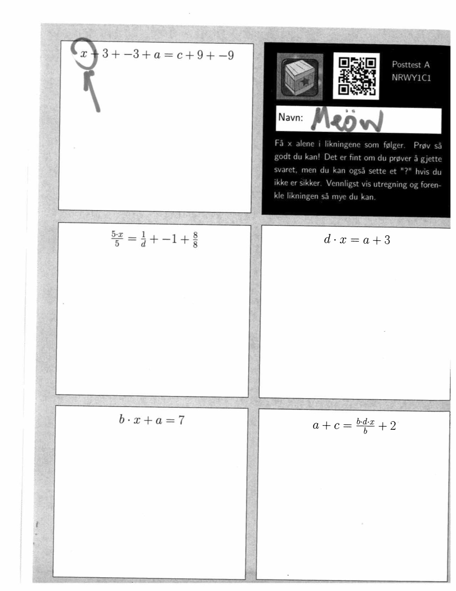
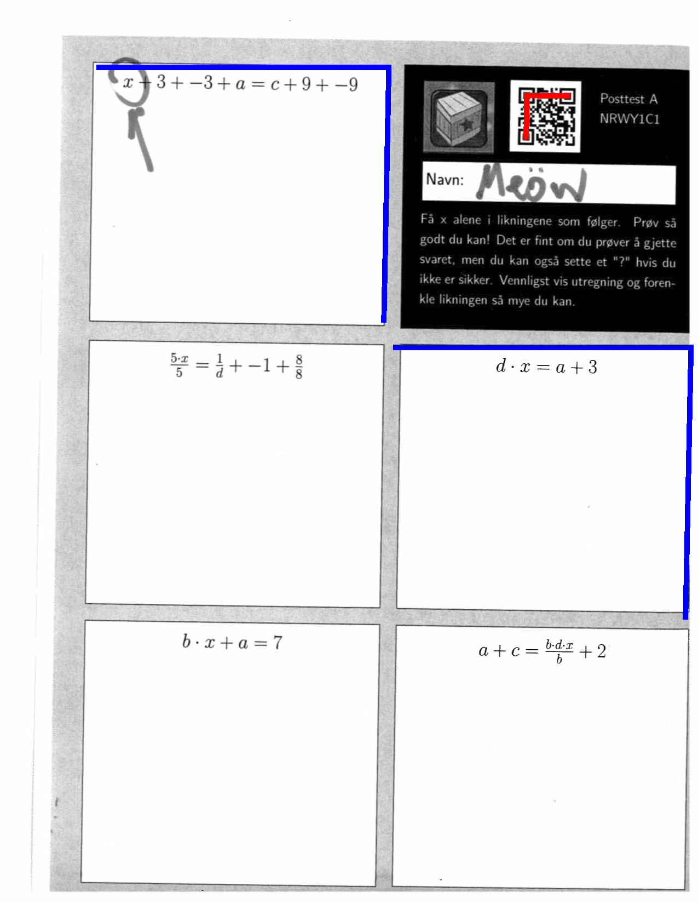
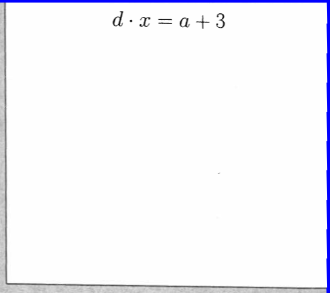

MathQuizTileExtractor
============

Reads an image of a scanned math test and uses the QR code to:
* extract info from the QR code
* use the QR code to localize the different math equation boxes
* save individual math equation box to a new file

### input (scan2.png): scanned test ###

### test output (saved.png): marked up test ###

### more output (tilefile.png): one equation box cropped out ###

